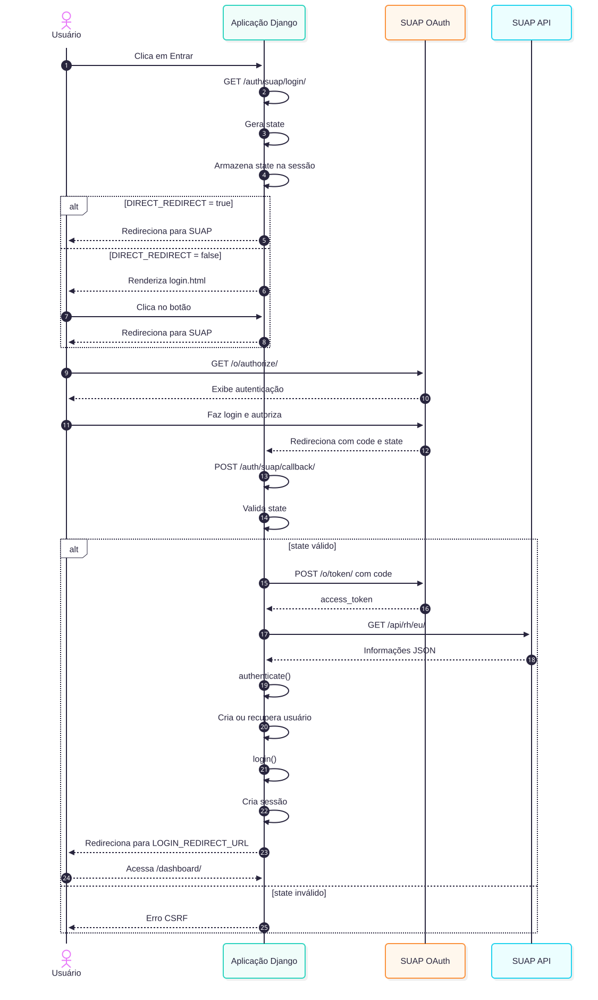

===================
Authentication Flow
===================

Overview
========

``django-suap-auth`` implements the standard OAuth2 Authorization Code flow.

   SUAP Authentication Flow

Direct Redirect (Default)
=========================

With ``DIRECT_REDIRECT = True`` (default in ``SUAP_AUTH``), the user is immediately redirected to SUAP when visiting ``/auth/suap/login/``.

Intermediate Login Page
=======================

With ``DIRECT_REDIRECT = False`` in ``SUAP_AUTH``, the login view renders an intermediate page (``django_suap_auth/login.html``) where the user clicks a button to proceed to SUAP.

CSRF Protection
===============

The state parameter is generated using ``secrets.token_urlsafe(32)`` and stored in the session. It is validated during callback to prevent CSRF attacks.

Session Termination (Logout)
============================

When logging out through the default route (``/auth/suap/logout/``), the template ``registration/logged_out.html`` is rendered.
This template informs the user that logging out terminates only the local application session and explains that SUAP does not have a centralized Single Sign-Out mechanism across all applications. It offers clear options, including a direct link to SUAP via the template tag ````.
